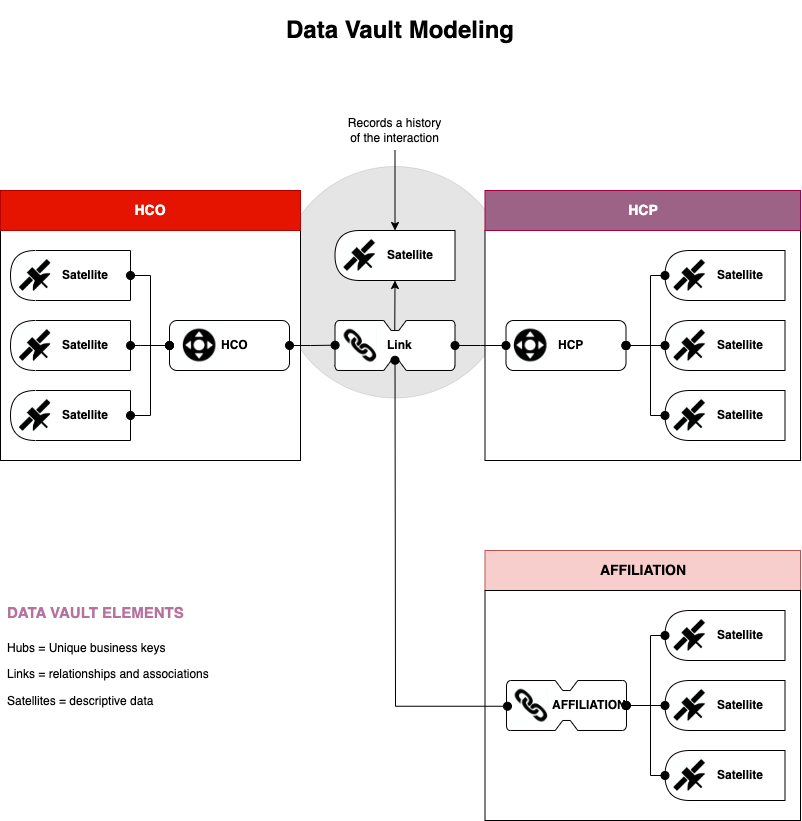

# 一、DV数据建模简介

## DV数据建模的背景故事

发明者：Dan Linstedt

Dan 在上个世纪从美国国防部项目中接手了数据仓库的项目，当时国防部给Dan提的需求是需要长期保存所有历史数据，并且数据仓库本身能够适应业务的不断变化，能长期、稳健的支持数据分析的需求，在需要的时候，可以还原并追踪原始数据用于数据审计。

---
## 为什么需要Data Vault 建模

1. Audibility -- 可审计性
2. Traceability -- 可追踪性
3. Compliance & legal -- 合规及法务要求
4. Data Governance & PIPL & GDPR -- 数据治理及个人敏感信息保护法

> Data Vault数据建模是除了，ER模型，星型（Star Schema）模型之外的另外一种选择，企业是否有必要采用Data Vault进行建模取决于对于自身数据资产的理解，数据是否需要极度的安全保障，是否需要严格的可追踪和审计，以及是否涉及个人敏感信息等。
> 
> 数据建模，依然是为了数据分析的目的，任何企业都希望通过自身积累的数据分析出其终端用户的日常行为，用户画像，偏好等，并希望利用其分析的结果为企业创造更多的销售机会（sales opportunity），无论是哪种数据模型，最终的输出依然会通过常见的BI工具以报告的形式进行展现。
>
> 长远来看，Data Vault数据建模从数据工程角度来讲，因为其极度友好的可扩展性（scalable）和适应性（adaptable），以及业务角度于数据资产的可审计（auditable）、可追踪（traceability），值得在数据仓库的建模方法进行推广和实践。

---
## Data Vault 2.0 Specification DV2.0规范

1. **methodology** (SEI/CMMI, Six Sigma, SDLC, etc..),  -- 方法论
2. the **architecture** (amongst others an input layer (data stage, called persistent staging area in Data Vault 2.0) and a presentation layer (data mart), -- 系统架构
3. **handling of data quality services and master data services**, and the model. Within the methodology, the implementation of best practices is defined. -- 数据质量及主数据，数据建模及实施

> 区别于Data Vault 1.0的数据建模，Data Vault 2.0不仅仅是一种数据建模方法（modeling），还包括了方法论（methodology）和数据架构（data architeture），这三部分内容加上数据建模实施（implementation），主数据与数据质量体系（master data, data quality)组成了完整的Data Vault2.0的生态。

 
---
## Definitions 定义

A Data Vault is defined as a 

- **detail oriented** -- 注重细节的
- **historical tracking** -- 可以追踪历史的
- **and uniquely linked**  -- 唯一的被连接起来的

set of normalized tables that support one or more functional areas of business.
一系列范式化的数据表，并且可以支持一个或多个不同的业务功能。

## Reference Materials

> * https://en.wikipedia.org/wiki/Data_Vault_Modeling
> * [DVModelingSpecs2-0-2](pdfs/DVModelingSpecs2-0-1.pdf)