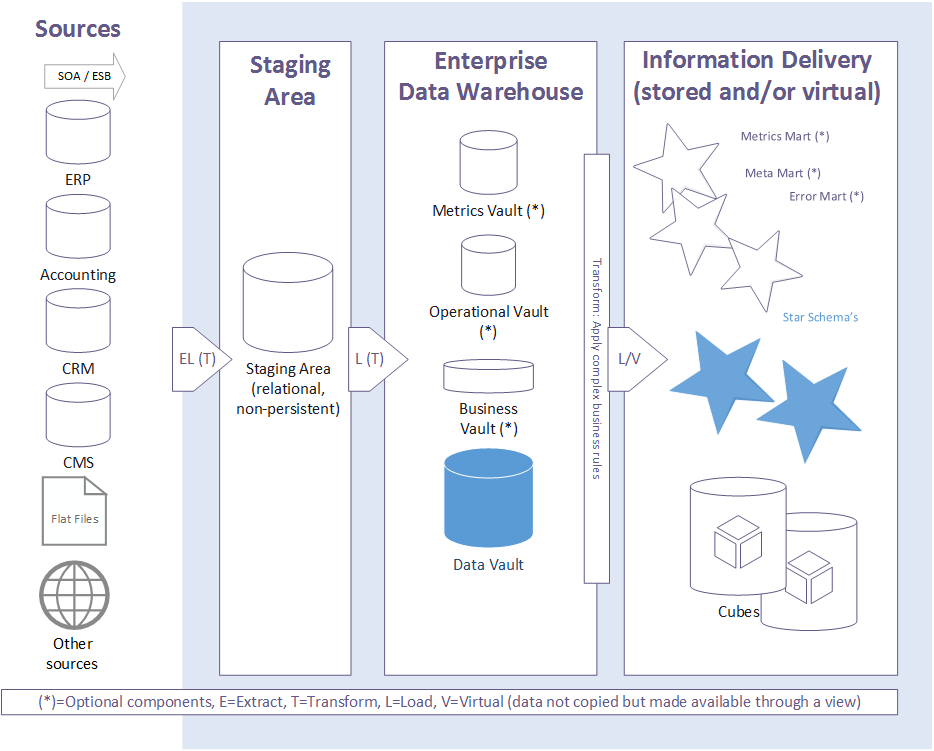

# 二、整体架构

整体架构如下图所示，主要分为三层架构：

1. **Staging Area** -- 数据暂存区
   * Starging Table -- 数据暂存区
   * Change Data Capture Table -- 变化数据捕捉层
   * Persistant Staging Area -- 历史数据存储区

2. **Enterprise Data Wareshouse** -- 企业级数据仓库
   * Raw Data Vault -- 原始DV模型
   * Business Data Vault -- 业务DV模型
   * Operation Vault & Matrics Vault -- 运营及指标DV模型

3. **Information Delivery** -- 数据集市层
   * Star Schema -- 星型模型
   * Meta Mart -- 元数据集市
   * Error Mart -- 错误信息日志集市

---
**值得注意的事项：**

1. 数据从源系统到EDW的加载过程是通过ELT的方式，即数据加载过程中没有或极少进行数据转换，保证原始数据在不做任何加工及处理前提下进入数据仓库；ETL is dead，尤其在大数据环境下。
2. 通过元数据来驱动数据变化，并订阅变化数据捕捉机制；需要建立数据自动化工具，来实现这一过程；
3. 对于业务数据中的规则，区分为Hard Rule和Soft Business Rule，分别在ELT/ETL中进行处理；RDV的数据仅对Hard Rule进行处理，BDV中会根据Soft Business Rule进行拆分和处理；
4. 数据进入数据仓库的时间，被称为Assersion Time，或 Inscription Time，即业务数据被数据仓库第一次识别并标记的时间，后续的所有Layer都会延续这个时间戳对业务数据进行处理。

---
## PSA and CDC

在Data Vault及大部分数据仓库理论体系中，数据临时存储区，又被称作Staging Area，如下图所示，人们乘坐飞机，在登机前的候机楼及栈道就好像是暂存区，待飞机（Pipeline）将人们从出发地（源系统），运送至目的地（数据仓库）。

架构层面，对比本章最初的图示，增加了PSA区域，即数据永久存储区（Persistant Staging Area)，为了形象的理解它，我们可以将PSA理解为实际意义中的仓库，所有的原材料都会被运送至仓库，待需要的时候，再拿出来使用。

### What is CDC 什么是CDC

业务系统的变更数据采集（也称为原生变更数据采集，原生 CDC ）持续识别和采集数据的变更。我们指的是数据的插入和更新，下面统称为变化，以及运营系统对数据的删除。

简而言之，CDC通过使用一个定义好的键对新旧数据集进行比较来检测变化。在业务系统的数据结构中，这通常是一个表的物理主键。如果非键数据元素的数据不同（新的或改变的），CDC检测到一个 "改变"，并传输改变的数据记录和所有数据元素。

在删除记录 "Delete "的情况下，原生 CDC 通常只传送检测到变化所依据的键的数据元素。关于键以外的哪些数据被删除的信息与原生 CDC 没有关系。有些 CDC 系统不仅提供被删除数据集的键，还提供包含所有信息的完整数据集。

这两种变体都会导致目标中的Data Vault数据模型的问题： 什么可以或必须被删除？毕竟，数据建模者在技术上根据业务对象组织数据方面投入了大量的精力。

### CDC的好处是什么？

通常来讲，对于业务系统实现原生的CDC机制，将会大量应用触发器Trigger机制，对所有的增删改等事务操作进行判断，并捕获变化数据，这些变化通常包含了来自于业务本身内容的变化，以及技术字段的变化（如更新时间，更新人等）。这将会对业务系统的运行产生必要的影响，从而可能会消耗业务系统的硬件资源；从数据分析的角度来看，也产生了一些对数据分析无实际影响的数据（如技术字段变化导致的“新增”数据）。

只有实际的变化才会在运营系统和分析系统之间传输，这大大降低了运营系统的负荷。从今天的角度来看，CDC对于实现可扩展性、效率和实时行为要求而不影响相关系统确实很重要。

---
## Reference Materials

> * [Why would you want to make use of a PSA, and what are its pros and cons?](https://dwa.guide/2017/06/08/using-a-persistent-staging-area-what-why-and-how/)
> * [Understanding CDC to properly delete data in Data Vault](https://tedamoh.com/en/academy/secret-spice/coaching/251-understanding-cdc-to-properly-delete-data-in-data-vault)