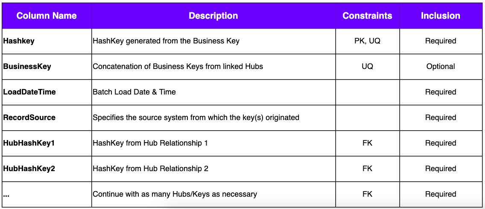
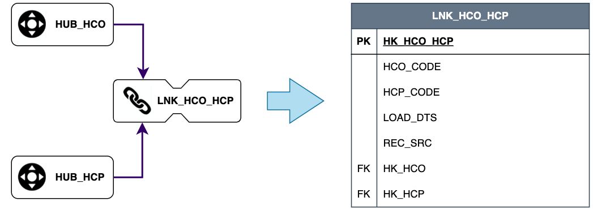
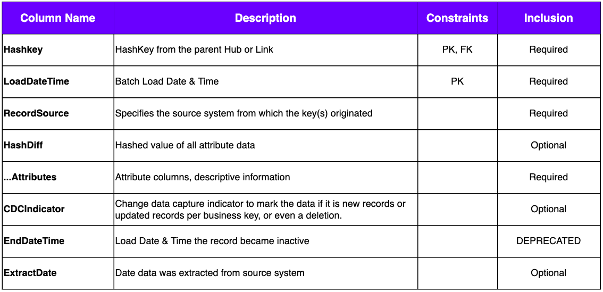

> 今天的文章将聚焦于Data Vault2.0数据建模中最为核心的三类模型实体，分别是枢纽、链接和卫星。本文不涉及到Business Data Vault的概念，关于BDV的概念，将会在后续章节中陆续为大家介绍。

## Hubs 枢纽

a single business entity identified by a stabile, unchanging business key, it is a **UNIQUE** list of business keys. 

Data is inserted into the hub once per business key and not changed after that.
> Hubs中的数据代表了具有相同业务概念的，唯一的业务键的列表，其数据一旦被加载到Hub表，将不会重复加载，且通常不会被删除。

**什么是Business Key**

Keys that are supplied by users to identify, track and locate information, such as HCP code, event number, or product number.

> Business key should be
> 1. unique -- 业务上是唯一的
> 2. at the same level of granularity  -- 业务上具有相同的颗粒度

**Hub表的基本结构**

> Hash values 是Data Vault 2.0建模中的基础功能。
> 1. 通常是通过数据库引擎Build-in function在数据加载过程中通过业务键计算出来的，如MD5；
> 2. 哈希计算值减少了数据对象之间的相互依赖，并且能够提升表连接的性能；
> 3. 哈希计算值便于对比及监测数据内容的变化；
>
> LastSeenDate，可选字段，意味着最后一次识别时间，通常用于数据仓库系统在从源系统加载原始数据到Hub表的时候用于更新此字段，如果此字段长时间没有更新，则在符合一定业务规则后，会被数据仓库系统在后续的Business Data Vault模型中标记为删除状态。**目前已在新的规范中弃用**，原因是：
>   * 需要物理更新所有数据，更新操作不被所有平台接受；
>   * 降低了数据仓库系统的性能；
>   * 降低了数据模型的可扩展性；
>

**Hub表的数据加载模式**

**HCP医学专业人士的Hub表设计**

---
## Links 链接

a relationship between two or more business keys. Links connect the hubs.

> Links 类似于星型模型中的FACT table，即事实表，关联了多个业务实体；
> 1. Links 并不记录或显示链接关系是否生效或失效；
>   * 如果的确有类似需求，通常会放在Link-Satellite里面进行处理；
> 2. Links 通常都是Insert的操作，不会有更新（update）操作；
> 3. 高阶应用中会有Same-As Link，或Hierarchical Link以及Non-Historized Link(Aka Transactional);

**Link表的基本结构**

**Link的数据加载模式**

**医学专业人士HCP与医疗组织机构HCO的关联关系**
> HCO Code和HCP Code是可选的，如果在Link表中选择了这两个字段，在后续使用时可以减少对Hub表的关联；

---
## Satellites 卫星

Timephase data that describe hub or links. Rows are inserted (no updates please) into the satellite as new data is ingested into the data vault. Each satellite is populated from a single data source and provides an audit trail of all changes.

> 卫星表保存了所有描述性信息，且存储了所有历史记录，含所有数据的变化；
> 1. 卫星表通常按数据源进行划分，或者按描述性信息的变动频率进行划分；
> 2. 卫星表有且仅有一个父节点，或者是Hub，或者是Link，它不可归属于多个模型实体；
>   * 但Hub或者Link允许包含多个Satellites；
> 3. 卫星表必须至少包含一个Hub或者Link的主键作为自己的主键，且不能自己派生代理键；
> 4. 卫星表中的HashKey是所有描述信息进行哈希运算之后的结果，通常通过这个字段来判断数据变化；

**卫星表的基本结构**

> EndDateTime，表示某一条描述性信息失效的时间，不作为卫星表的主键；**目前已在新的规范中弃用**，原因是：
>   * 需要物理更新所有数据，更新操作不被所有平台接受；
>   * 降低了数据仓库系统的性能；
>   * 降低了数据模型的可扩展性；
> 
> HashDiff，表示的是所有描述性信息的哈希值，用于计算数据的变化，但并非强制要求显示在卫星表中；
> 
> ExtractDate，表示数据从源系统抽取的时间，区别于数据真正加载到数据仓库的时间（Load Datetime），是可选的，在一些数据集成中会有帮助；

**卫星表的数据加载模式**

> 无论是Hub，Link还是Satellite，都使用了相同的数据加载模式，即Insert Only的模式，在数据ELT的过程中没有任何更新、删除操作。这么做的好处在于：
> 1. 增加了数据加载的效率，数据库引擎仅需要做插入操作，不必频繁操作数据的读写；
> 2. 更加适应于大数据环境，如Hadoop生态中的Hive数据仓库，避免了Overwrite的操作；
> 3. 数据从源系统到Data Vault数据仓库，三个组件完全可以并行处理，极大的提高了数据加载的速度和效率；

**医学专业人士的个人信息卫星表**

卫星表中，我们将所有描述性信息进行了哈希计算，并得到了用于对比数据变化的字段HashDiff。后续的CDC机制，将会标识出这部分数据是否是新增，更新或是删除操作（取决于数据对象的更新机制是全量还是增量）。

## Reference
> * [Data Vault 2.0 – A Method of Business Intelligence](https://www.youtube.com/watch?v=FrdEROEUvVI)
> * [DVModelingSpecs2-0-2](pdfs/DVModelingSpecs2-0-1.pdf)